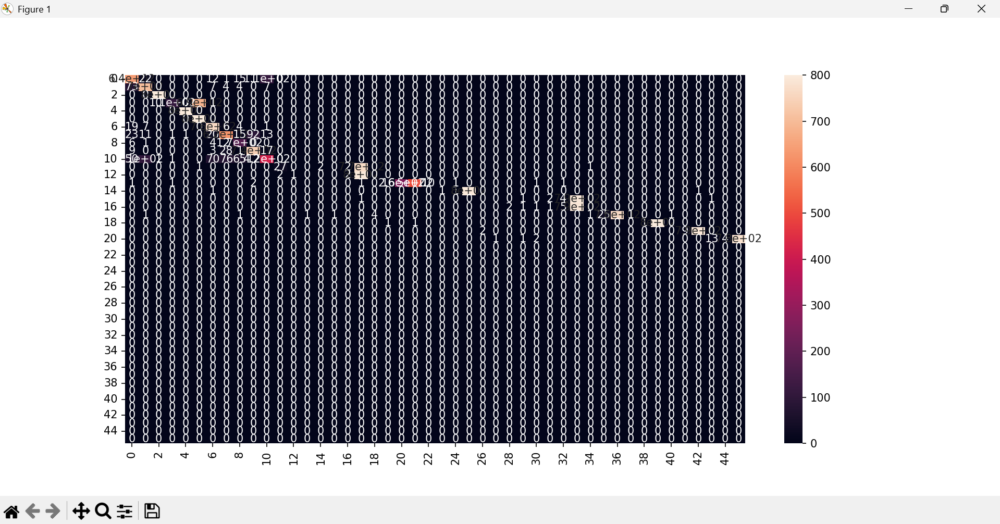

# IoMT Attack Detection using Machine Learning

## 📌 Project Overview
This project detects cyber attacks in IoMT (Internet of Medical Things) network traffic using machine learning algorithms.
Dataset used - https://www.kaggle.com/datasets/limamateus/cic-iomt-2024-wifi-mqtt?resource=download

---

## ⚙️ Algorithms Used
- Logistic Regression
- K-Nearest Neighbors (KNN)
- Decision Tree
- Random Forest
- Naive Bayes

---

## 🔧 Features Implemented
- Data Preprocessing
- Feature Encoding
- Feature Scaling
- Classification Models
- Clustering (KMeans)
- Dimensionality Reduction (PCA)
- Confusion Matrix Visualization

---

## 📊 Results

### Model Accuracy
Logistic Regression : 0.84
KNN : 0.91
Decision Tree : 0.93
Random Forest : 0.97
Naive Bayes : 0.80

👉 Random Forest performed the best.

---

## 📉 Confusion Matrix


---

## 📈 PCA Visualization


---

## ▶️ How to Run

```bash
pip install -r requirements.txt
python main.py


🎯 Conclusion

The project successfully detects different types of IoMT cyber attacks.
Random Forest achieved the highest accuracy and is the most effective model for this dataset.
